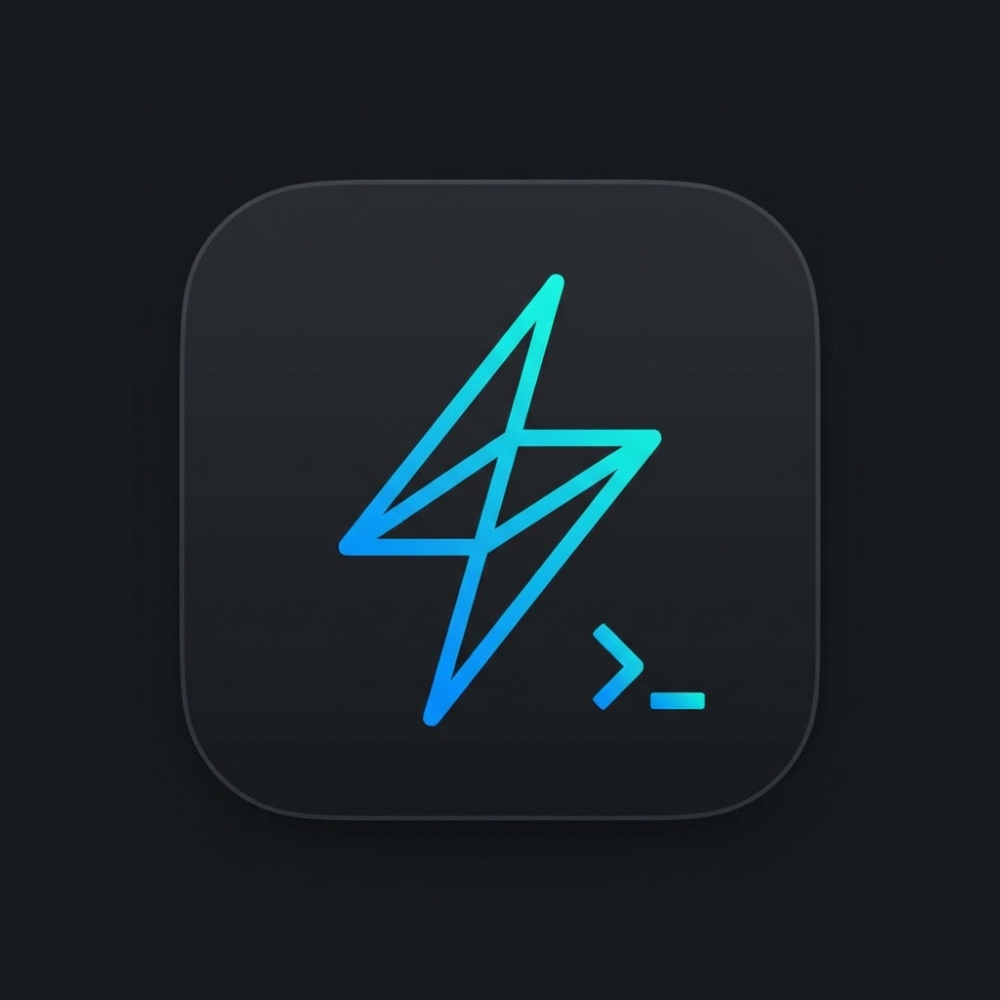

<div align="center">

# Patterm



**A professional serial terminal application built with Electron**

[](https://github.com/oroliy/patterm/releases/latest)
[](https://github.com/oroliy/patterm/blob/master/LICENSE)
[](https://github.com/oroliy/patterm/issues)
[](https://github.com/oroliy/patterm/stargazers)
[](https://nodejs.org)
[](https://www.electronjs.org)

[Features](#features) • [Installation](#installation) • [Usage](#usage) • [Development](#development) • [Contributing](#contributing)

</div>

---

## Features

### Multi-Tab Management
- Open and manage multiple serial connections in independent tabs
- Each tab has its own serial connection, terminal, and input field
- Automatic tab creation with connection dialog
- Custom tab names with port display
- Connection status indicators (● for connected, ○ for disconnected)
- Desktop and Web now share the same tab and terminal shell
- Web session restore reopens disconnected tabs and keeps per-tab filter state after reload
- Per-tab search result count, next/previous navigation, and active match highlighting
- Global search jumps across tabs to the exact matching terminal entry
- Per-tab read-only trigger rules can mark matching `RX`, `TX`, or `Error` lines with highlight badges
- Per-tab workflow runner can execute a simple `send -> wait for match` automation flow
- Per-tab transaction panel groups `TX -> RX` traffic into request/response or passive blocks with jump-back, copy, export, star, rename, failed/starred filters, failure summaries, and visible-block export
- Header theme control now separates `System / Dark / Light` appearance from built-in theme presets including `Patterm Blue`, `Claude Canvas`, `Verdant Lab`, and `Signal Grid`

### Complete UART Configuration
- **Baud rates**: 110 to 921600
- **Data bits**: 5, 6, 7, 8
- **Stop bits**: 1, 1.5, 2
- **Parity**: None, Odd, Even, Mark, Space
- **Flow control**: RTS/CTS, XON/XOFF

### Connection Dialog
- Intuitive modal for creating new connections
- Port selection with manufacturer info
- Custom tab naming
- All serial parameters in one place
- Port refresh functionality

### Real-Time Serial I/O
- Send and receive data with minimal latency
- Millisecond-precision timestamps on all data lines
- Support for CRLF, CR, and LF line endings
- Per-tab terminal search with `All`, `RX`, `TX`, and `Error` filters
- Search result count with previous/next navigation and highlighted active match
- Cross-tab global search with `All`, `RX`, `TX`, and `Error` scopes
- Read-only trigger highlights with per-tab rules for `Contains` and `Regex` matching
- Workflow MVP with per-tab definitions, timeout handling, and run/stop controls
- Transaction panel MVP with time-window grouping, jump-to-entry navigation, copy/export actions, starred blocks, rename, `All / Failed / Starred` filters, failure summaries, and visible-block export

### Workspace Controls
- Header theme panel with explicit appearance modes plus built-in presets such as `Claude Canvas`
- Refreshed About dialog with current surface, theme, tab count, version, commit ID, and active capabilities

### Context Menus
- **Tab Right-Click Menu**: Quick access to:
  - Close Tab, Disconnect/Reconnect
  - Clear Screen, Save Output, Copy All Text
  - Rename Tab, Show Connection Settings
- **Terminal Right-Click Menu**:
  - Clear Screen, Save Output, Copy All Text

### Status Bar
- Connection status with visual indicator
- Port configuration display (e.g., `/tmp/ttyV0 @ 115200 8N1`)
- RX/TX byte counters with auto-scaling
- Real-time data rate indicators (B/s)
- Connection duration timer
- Created time and current time display

### Debug Console
- Real-time logging of application events
- Color-coded log levels (info, warn, error, debug)
- Selectable and copyable log entries
- Timestamp for each log entry
- Clear logs with `Ctrl/Cmd + L`

### File Logging
- Manual logging (start/stop on demand)
- Auto logging (continuous)
- Timestamped entries
- Per-tab logging support

### Cross-Platform
-  NSIS + Portable
-  DMG
-  AppImage + deb
-  Chrome 89+

### Web Version (PWA) 🌐
A Progressive Web App version is also available, featuring:
- **Browser-based serial terminal** using Web Serial API
- **Offline support** via service worker
- **Installable** as desktop app from browser
- Same feature set as desktop version (multi-tab, all UART configs, logging)
- Shared serial provider contract across Web and Electron renderer flows
- Hardened Electron desktop windows with preload-only APIs, `contextIsolation: true`, and native save handling in the main process
- **HTTPS required** for Web Serial API (localhost exempt)

**Web Development Commands:**
```bash
npm run web:dev      # Start Vite dev server (HTTPS, localhost:5173)
npm run web:build    # Build for production
npm run web:preview  # Preview production build
npm run web:serve    # Serve production build with HTTPS
npm run web:test     # Start Vite automatically and run Playwright E2E tests
```

**Browser Support**: Chrome 89+, Edge 89+, Opera 75+ (Web Serial API required)
*Firefox and Safari are not supported.*

### Keyboard Shortcuts
| Shortcut | Action |
|----------|--------|
| `Ctrl/Cmd + N` | New connection |
| `Ctrl/Cmd + K` | Open command palette |
| `Ctrl/Cmd + W` | Close window |
| `Ctrl/Cmd + Shift + D` | Toggle debug console |

---

## Download

### Latest Release: v0.7.1

**[Download from GitHub Releases](https://github.com/oroliy/patterm/releases/tag/v0.7.1)**

Choose your platform:
- **Windows**: [Patterm-0.7.1-x64-setup.exe](https://github.com/oroliy/patterm/releases/download/v0.7.1/Patterm-0.7.1-x64-setup.exe) or [Patterm-0.7.1-x64-portable.exe](https://github.com/oroliy/patterm/releases/download/v0.7.1/Patterm-0.7.1-x64-portable.exe)
- **macOS**: [Patterm-0.7.1-x64.dmg](https://github.com/oroliy/patterm/releases/download/v0.7.1/Patterm-0.7.1-x64.dmg) (Intel) or [Patterm-0.7.1-arm64.dmg](https://github.com/oroliy/patterm/releases/download/v0.7.1/Patterm-0.7.1-arm64.dmg) (Apple Silicon)
- **Linux**: [Patterm-0.7.1-x64.AppImage](https://github.com/oroliy/patterm/releases/download/v0.7.1/Patterm-0.7.1-x64.AppImage) (x64), [Patterm-0.7.1-arm64.AppImage](https://github.com/oroliy/patterm/releases/download/v0.7.1/Patterm-0.7.1-arm64.AppImage) (ARM64), [Patterm-0.7.1-x64.deb](https://github.com/oroliy/patterm/releases/download/v0.7.1/Patterm-0.7.1-x64.deb) (x64), or [Patterm-0.7.1-arm64.deb](https://github.com/oroliy/patterm/releases/download/v0.7.1/Patterm-0.7.1-arm64.deb) (ARM64)

**Web Version**: Open https://patterm.pages.dev/ or https://oroliy.github.io/patterm/ in Chrome, Edge, or Opera (requires HTTPS or localhost)

[View all releases](https://github.com/oroliy/patterm/releases)

---

## Installation

### Prerequisites

- Node.js 20.x or higher
- npm (comes with Node.js)

### Install Dependencies

```bash
npm install
```

For users in China, use the Electron mirror for faster downloads:

```bash
ELECTRON_MIRROR=https://npmmirror.com/mirrors/electron/ npm install
```

---

## Usage

### Start the Application

```bash
npm start
```

### Basic Workflow

1. **Launch application** with `npm start`
2. **Click "New Connection"** (or press `Ctrl/Cmd + N`) to open connection dialog
3. **Configure connection settings**:
   - Optional: Enter custom tab name
   - Select serial port from dropdown
   - Configure baud rate, data bits, stop bits, parity
   - Click "Connect" to create tab and open serial port
4. **Send data** by typing in the input field, preserving pasted newlines/spacing, and clicking Send or pressing `Ctrl/Cmd + Enter` (in the tab)
5. **View received data** in the terminal window (per tab)
6. **Create more connections** with `Ctrl/Cmd + N` for additional serial ports
7. **Switch between tabs** to manage different connections
8. **Enable logging** to save serial data to a file (per tab)
9. **Open Blocks** in a tab to inspect grouped request/response traffic, rename or star important blocks, review failure summaries, filter to failed/starred blocks, and export one block or all visible blocks
10. **Close tab** to disconnect serial port and remove tab

---

## Development

### Project Structure

```
patterm/
├── src/
│   ├── main/           # Electron main process
│   │   ├── main.js     # Application entry point
│   │   └── window-manager.js  # Main window lifecycle helper
│   ├── renderer/       # Electron renderer shell
│   │   ├── index.html  # Main window HTML
│   │   ├── main.js     # Desktop renderer bootstrap
│   │   ├── connection-dialog.js  # Electron connection dialog bridge
│   │   ├── ElectronConnectionDialog.js  # Desktop dialog wrapper over shared UI
│   │   ├── services/   # Electron IPC-backed serial provider
│   │   ├── debug-window.html  # Debug console UI
│   │   └── styles.css  # Desktop shell styles
│   ├── services/       # Business logic
│   │   ├── serial-service.js  # Single serial port operations
│   │   └── serial-service-manager.js  # Multi-connection management
│   ├── shared/         # Shared code (desktop + web)
│   │   ├── css/        # Common CSS variables and reset
│   │   └── js/         # Shared utilities, app shell, and serial abstractions
│   ├── generated/      # Generated build metadata
│   └── web/            # Web version source (PWA)
│       ├── js/         # Web app entry and components
│       │   ├── components/  # UI components (ConnectionDialog, Tab, Terminal)
│       │   ├── services/  # Web Serial API services
│       │   └── utils/     # Utility modules
│       └── css/        # Web-specific styles
├── web/                # Web version entry and build config
│   ├── index.html     # Web app HTML
│   ├── vite.config.js  # Vite build configuration
│   ├── public/        # Static assets
│   └── tests/         # Playwright E2E tests
├── scripts/           # Utility scripts
├── tests/             # Jest test suites
├── .github/workflows/  # CI/CD configuration
├── package.json
├── AGENTS.md          # Development guidelines
└── CLAUDE.md          # AI agent guidance
```

### Development Commands

```bash
# Desktop App Development
npm run dev            # Start Electron desktop development mode directly
npm run dev:renderer   # Print the renderer-loading note; no localhost:3000 server is needed
npm start              # Start Electron with the same file-based renderer loading flow
npm run dist           # Build distribution packages for current platform
npm run dist:win       # Windows only
npm run dist:mac       # macOS only
npm run dist:linux     # Linux only

# Web PWA Development
npm run web:dev        # Start Vite dev server (HTTPS, localhost:5173)
npm run web:build      # Build web version for production
npm run web:preview    # Preview production build
npm run web:serve      # Serve with HTTPS
npm run web:test       # Run Playwright E2E tests

# Testing
npm test               # Run Jest unit tests
npm run test:e2e       # Quick E2E test with virtual serial port
npm run test:electron  # Run Playwright Electron E2E tests
npm run web:test       # Start Vite automatically and run Playwright web E2E tests
npm run web:test:ci    # Run the CI headless web suite with the shared Playwright web server config
npm run test:ci        # Run the local CI gate: lint + unit + web + Electron
npm run lint           # Run the repository lint gate for src/, tests/, and web/
```

### Testing

CI now enforces four stages before build and deploy:
- `lint`
- `unit-test`
- `web-test`
- `electron-test`

The Web CI suite now asserts the actual UI flow: open the connection dialog, select a mocked Web Serial port through `navigator.serial.requestPort()`, connect, send data, and verify TX/RX content renders in the main terminal area. Ad-hoc debug specs are kept out of the CI path.

Jest now also instruments shared/Web frontend modules through the local transformer at
`tests/support/frontend-transformer.js`, so coverage reports include UI modules such as
`AppShell`, `TabComponent`, `TerminalComponent`, and `terminalEntries`.
The current Jest coverage suite also exercises Web bootstrap flow plus Electron window helpers,
so `npm run test:coverage` now passes the repository's global 50% coverage gate locally.

Tag-based releases (`v*`) now wait for the Cloudflare Pages deploy job, then publish desktop artifacts to GitHub Releases. Pushes to `master` can deploy the Web PWA through Cloudflare Pages or GitHub Pages.

### GitHub Pages Deployment

Live URL: https://oroliy.github.io/patterm/

1. Open **GitHub -> Settings -> Pages**
2. Set **Source** to **GitHub Actions**
3. Push to `master` or run **Deploy Web PWA to GitHub Pages** manually
4. Open `https://oroliy.github.io/patterm/`

#### Quick E2E Test (Recommended)

```bash
# One-click test: creates virtual serial port and starts Patterm
npm run test:e2e
```

This will:
1. Create a virtual serial port at `/tmp/ttyV0`
2. Start the Patterm application
3. Display connection instructions
4. Automatically clean up on exit

**Additional options:**
```bash
bash scripts/test.sh -h      # Show help
bash scripts/test.sh -k      # Keep virtual port running after exit
bash scripts/test.sh -c      # Cleanup existing virtual ports
bash scripts/test.sh -p /tmp/ttyUSB0  # Use custom port path
```

**Send test data (in another terminal):**
```bash
echo "Hello Patterm!" | nc localhost 12345
telnet localhost 12345
```

#### Virtual Serial Port Testing

For testing without physical serial hardware, create virtual serial ports:

```bash
# Method 1: Create virtual port with socat (Recommended)
bash scripts/create-virtual-port.sh /tmp/ttyV0

# Then connect Patterm to /tmp/ttyV0

# Send test data via TCP:
telnet localhost 12345
# or
echo "Hello Patterm!" | nc localhost 12345
```

#### Quick Test Script

```bash
# Create virtual port and start echo server
bash scripts/quick-virtual-serial.sh

# Connect Patterm to the displayed port (e.g., /dev/pts/0)
# All sent data will be echoed back
```

#### Python Virtual Serial Port

```bash
# Run interactive virtual serial port
python3 scripts/virtual-serial.py

# Use commands: 1, 2, q, or type any text
```

#### Unit Tests

```bash
# Run all tests
npm test

# Run tests in watch mode
npm run test:watch

# Generate coverage report
npm run test:coverage

# Run specific test
npm test -- --testNamePattern="testName"
```

### Linting

`npm run lint` now runs the same repository-wide lint gate locally and in GitHub Actions.
It scans `src/`, `tests/`, and `web/`, parses both CommonJS and ESM entry points, and
fails with a non-zero exit code when it finds syntax errors, undefined references, or
unused local bindings.

```bash
# Run the same lint command used by CI
npm run lint
```

The lint runner is implemented in `scripts/lint.js`, so local runs and the CI `lint` job
use the exact same checks and file coverage.

### Building for Distribution

Electron Builder is configured to create platform-specific installers:

| Platform | Formats |
|----------|---------|
| Windows | NSIS installer (.exe) + Portable (.exe) |
| macOS | DMG disk image (.dmg) |
| Linux | AppImage + Debian package (.deb) |

Build artifacts are placed in the `dist/` directory.

---

## Contributing

We welcome contributions! Please follow these guidelines:

1. Read [AGENTS.md](./AGENTS.md) for coding standards
2. Write clear, descriptive commit messages
3. Test your changes thoroughly
4. Ensure code follows existing patterns
5. No comments in code unless explicitly requested

### Commit Message Format

Use conventional commits:

- `feat: ` - New feature
- `fix: ` - Bug fix
- `docs: ` - Documentation changes
- `refactor: ` - Code refactoring
- `test: ` - Test changes
- `chore: ` - Maintenance tasks

Example: `feat: implement serial port auto-reconnect`

---

## CI/CD

This project uses GitHub Actions for continuous integration:

- **Triggers**: Push to master, pull requests, tags
- **Platforms**: Ubuntu, macOS, Windows
- **Node version**: 20.x
- **Actions**: Lint, Build, Test, Release
- **Artifacts**: Build artifacts retained for 7 days
- **Releases**: Automatic on tagged commits (v*)


See `.github/workflows/ci-cd.yml` for configuration.

---

## License

MIT License - see LICENSE file for details

---

## Support

For issues, questions, or contributions:

-  [Open an issue](https://github.com/oroliy/patterm/issues)
- Check existing documentation in [AGENTS.md](./AGENTS.md)
- Review code examples in the repository

---

## Acknowledgments

Built with:

- [](https://www.electronjs.org/)
- [](https://serialport.io/)
- [](https://www.electron.build/)
- [](https://jestjs.io/)
- [](https://vitejs.org/)
- [](https://playwright.dev/)

---

<div align="center">

**Made with ❤️ by the Patterm Team**

[⬆ Back to Top](#patterm)

</div>
